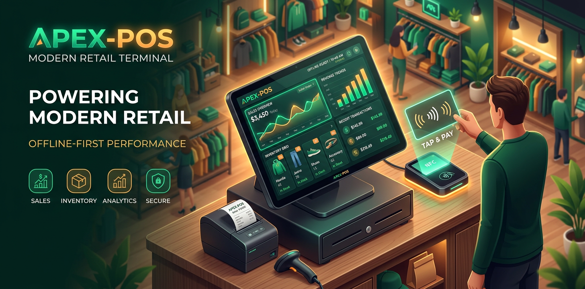

<p align="center">
  <a href="https://dlinacre.github.io/Apex-POS/">
    
  </a>
</p>

<h1 align="center">🛒 Apex POS — Offline-First Point of Sale</h1>

<p align="center">
  <strong>A complete point-of-sale system that runs entirely in the browser — no server, no cloud, no account.</strong>
</p>

<p align="center">
  <a href="https://dlinacre.github.io/Apex-POS/">
    
  </a>
  <a href="./LICENSE">
    
  </a>
  <a href="https://github.com/DLinacre/Apex-POS/stargazers">
    
  </a>
  <a href="https://github.com/DLinacre/Apex-POS/network">
    
  </a>
</p>

<p align="center">
  
  
  
  
  
  
  
  
</p>

<br>

<p align="center">
  <strong>Open it on a till, tablet or laptop and start selling: the whole database lives in IndexedDB on the device.</strong>
</p>

<p align="center">
  <a href="https://dlinacre.github.io/Apex-POS/">
    
  </a>
</p>

---

## ✨ Features

| Area | What you get |
|------|-------------|
| 🧾 **Register** | Product grid with categories & search, cart with quantities and line discounts, customer attach, held/suspended orders, cash/card/mobile payments with change calculator |
| 🖨️ **Receipts** | 80 mm thermal-print-ready receipts (`@media print` layout), configurable header/footer, instant reprint from sales history |
| 📦 **Inventory** | Products, categories, SKU/barcode fields, cost vs retail margin, low-stock alerts against reorder points |
| 👥 **Customers** | Profiles with loyalty points, contact details, notes and purchase linkage |
| 💸 **Expenses** | Dated expense tracking by category and payment method, included in profit reporting |
| 📊 **Reports** | Revenue & profit charts (Chart.js), best-sellers, category mix — all computed locally |
| 🏷️ **NFC tags (experimental)** | Read/write customer, product and employee NFC tags via Web NFC on supported Android/Chrome devices |
| 👤 **Roles** | Manager & Cashier profiles with passcode sign-in and quick switch |
| 🌙 **UX** | Dark mode, responsive down to phone width, keyboard-focus visible, `prefers-reduced-motion` support |
| 📴 **Offline** | Service worker makes the entire app load and trade with zero connectivity after first visit |

---

## 🚀 Quick Start

**▶ [Use it now (zero install)](https://dlinacre.github.io/Apex-POS/)**

**Run locally:**

```bash
git clone https://github.com/DLinacre/Apex-POS.git
cd Apex-POS
python3 -m http.server 8080        # any static server works
# open http://localhost:8080
```

> No build step, no `npm install`. `index.html` + `styles.css` + `db.js` + `app.js` is the whole app.

### Demo Credentials & Data

On first run the app seeds a demo store (products, customers, expenses and 10 days of sales history).

| Name | Role | Demo Passcode |
|------|------|--------------|
| Admin Manager | Manager | `1234` |
| Emma Watson | Cashier | `5555` |
| Liam Neeson | Cashier | `7777` |

⚠️ **Demo-only security:** passcodes are plain text in your local database and exist to demonstrate role switching — replace/remove them (Settings → Staff) before using Apex POS with real data. Reset everything any time with **Settings → Reset & reseed demo data**.

---

## ⚙️ Configuration

All store settings (name, address, currency, VAT/tax rate, receipt header/footer, low-stock threshold) live in the in-app **Settings** view and persist in IndexedDB.

**Google Sign-In (optional):** SSO is disabled unless you paste your own Google OAuth Client ID into *Settings → Google Client ID*. Only then is the Google Identity Services script loaded — nothing Google's way otherwise.

---

## 🛠 Tech Stack

| Layer | Choice | Notes |
|-------|--------|-------|
| UI | Vue 3 (global build) | Reactivity without a build step |
| Styling | Tailwind CSS + small custom sheet | Dark-mode aware |
| Database | Dexie.js over IndexedDB | All data stays on-device |
| Charts | Chart.js | Local reporting only |
| Offline | Hand-rolled service worker | App shell + CDN runtime cache |
| Security | Version-pinned CDNs with Subresource Integrity, CSP meta, `SameSite=Lax; Secure` cookies | See [SECURITY.md](./SECURITY.md) |

Dependency versions are **pinned with SRI hashes** on purpose: the app runs the same code in five years that it runs today — verify the hashes with `openssl dgst -sha384 -binary file | openssl base64 -A`.

---

## 🔒 Privacy

Everything you sell, stock or expense never leaves the browser. There are:
- ❌ **No** analytics
- ❌ **No** trackers
- ❌ **No** cookies except benign session markers
- ✅ Framework CDNs (pinned + SRI hashed)
- ✅ Optional Google SSO (opt-in only)
- ✅ Demo product images (Unsplash) — replaceable in your own data

---

## 📚 Documentation

- [Privacy Policy](./privacy.html) — how your data is handled
- [CHANGELOG](./CHANGELOG.md) — version history & release notes
- [CONTRIBUTING](./CONTRIBUTING.md) — how to contribute
- [SECURITY](./SECURITY.md) — security policy & vulnerability reporting
- [License (MIT)](./LICENSE)

---

## 🗺 Roadmap

- [x] NFC tag read/write support (Web NFC)
- [x] PWA installable with offline support
- [x] Dark mode with persistent preference
- [x] Google Sign-In integration (opt-in)
- [x] **Barcode scanner support** (Web BarcodeDetector API + camera)
- [x] **CSV import/export for products & sales** (sales CSV export added)
- [x] **Multi-tab device sync** (BroadcastChannel API, opt-in, same-origin tabs)
- [x] **Receipt logo upload** (Settings → Upload Logo, displays on printed receipts)
- [x] **Compiled-Tailwind production stylesheet** (`tailwind-compiled.css`)

### Future ideas
- Barcode scanner via WebHID for dedicated hardware
- Multi-device sync via WebRTC / IPFS (serverless)
- Receipt PDF export
- Dark mode auto-follow system preference

Contributions welcome — open an issue or PR!

---

## 🙏 Contributing

We welcome contributions! Please see our [Contributing Guide](./CONTRIBUTING.md) for details.

1. 🍴 Fork the repository
2. 🌿 Create a feature branch (`git checkout -b feature/amazing-feature`)
3. 🛠 Make your changes
4. ✅ Test thoroughly (offline, online, dark mode, mobile)
5. 📝 Commit with clear messages
6. 🔀 Open a PR against the `main` branch

---

## 📊 Project Stats

<p align="center">
  
  
  
  
</p>

---

## 📄 License

[MIT](./LICENSE) © 2026 David Linacre

<p align="center">
  <sub>Built with ❤️ for the open-source community</sub>
</p>

<p align="center">
  <a href="https://dlinacre.github.io/Apex-POS/">
    
  </a>
</p>
